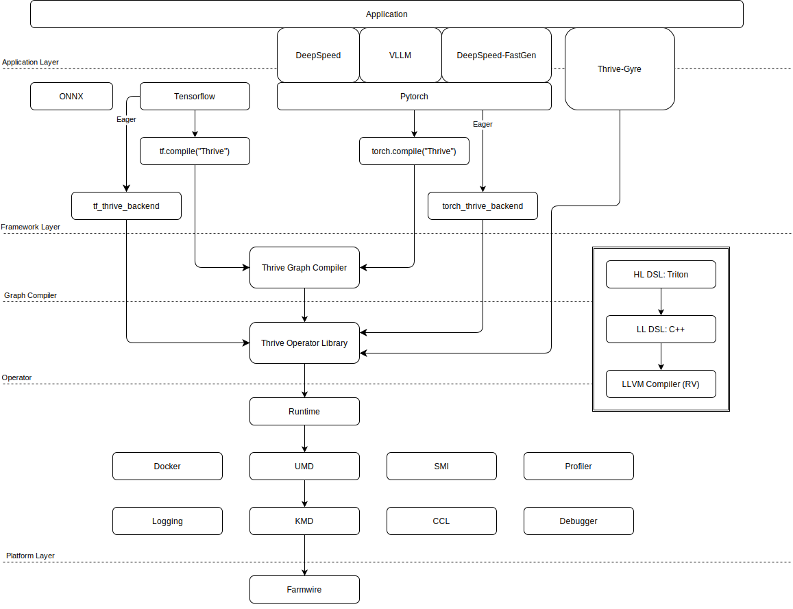

# AI 芯片软件栈以及软件团队的构建

AI 芯片软件工程将围绕着AI芯片软件栈进行功能团队的构建，构建软件栈的技术路线有很多，需要根据明确的产品定义（PRD）选择最合适的路径，同时参考市场要求（MRD）确定优先级。目前还没有 MRD 和 PRD，暂且根据前期的简单交流，总结一下需求以及对应的资源：

* 支持训推一体
* 初期可以先不支持客户开发算子，未来也许有超算用户开发需求
* 计算单元使用RISC-V架构，已有编译器，但优化效率以及需求响应速度未知
* 可以先不考虑云平台对驱动的高标准要求，不支持虚拟化
* 24年底软件团队规模50人以上，25年底软件团队规模200人

## 1. AI 芯片软件栈

根据以上需求以及今年计划能够到位的资源情况，24年可以先打通软件栈架构图的绿色通路：

___Figure1: AI芯片软件栈，端到端需要尽快打通（绿色通路），AI编译器（蓝色通路）次之。___

### 1.1 Application Layer

姑且把目前流行的扩展框架（基于pytorch等基础框架之上）的部分放到了这一层，主要是因为应用层上可以进行一些算法的开发，和基座框架还是有明显区别的。比如训练的ZERO优化器，比如推理的PagedAttention等等优化是做到这一层上的。我们可以优先支持一个训练一个推理的生态上流行的扩展框架，以保证大多数的训练和推理业务能够被使能起来。

### 1.2 Framework Layer

在当前的AI开源框架中 Pytorch 已经取得了明显的优势，随着 Pytorch2.0的推出，这一优势还在扩大，单纯从产品的角度来说只支持Pytorch其实已经足够解决大多数用户需求。然而，在国产算力的竞争中，国家的认可和投入也极其重要，在国产算力验收平台上，也许仍旧需要支持PaddlePaddle，支持oneflow等国产框架。另外在有些友商能够影响的测试平台上，也许还要支持 tensorflow 等我们没有计划支持的框架，这个时候任何缺失的一块拼图都会被无限的放大。

优先支持Pytorch应该是不存在争议的，其他方面更多的取决于MRD，也就是我们打算做谁的生意。

### 1.3 AI Compiler Layer

这里主要涉及到上述架构图中蓝色的三个部分。

__工业级的AI编译器必须能够处理动态模型，并且相比于Eager模式要有性能提升__，否则将无法实用。

### 1.4 Operator Layer

当下的AI芯片软件栈整体上还是朝着基于AI编译器的方向发展，Nvidia提供cuBLAS、cuDNN等算子库，客户基于算子库构建应用的时代已经是过去时，Pytorch、Tensorflow 这类内部集成AI编译器的框架变成了构建应用的基础工具。下图中左面是当前GPU上最流行的算子开发和编译情况，两套编程方式最终在PTX这一层上进行了统一。

### 1.5 Platform Layer (Toolkit)

