# Programming Design

## HW Arch



* ```PE```：逻辑处理单元
* ```BANK```：与PE对应亲和的DRAM，可能由多个物理bank构成，目前认为这些bank与PE之间是拥有相同性状的。

## Programming Model

这是一款基于Send/Recv的数据流架构设计，与主流的 NV-GPGPU 有许多不同之处需要进行思考。编程模型是提供给算子研发工程师进行编程的工具，它需要对设备上的各种器件进行功能上的抽象，保证软件的兼容性和可移植性。一般而言我们希望编程模型能够面向软件研发人员，在编程的灵活性和编程的复杂性之间找到一个平衡点。下面是一个编程模型将硬件直接暴露到算子开发界面上的例子，来自于Tenstorrent的 ```tt_metal```，这种方式更像是ASIC 的编程模型，相比较与CUDA会显得更加的复杂，软件开人员看到的是RISC-V-0，RISC-V-1 这种硬件细节，而不是通常意义上的异构计算、并行编程。

```c++
  /*
    * Specify data movement kernels for reading/writing data to/from
    * DRAM.
    */
  KernelHandle unary_reader_kernel_id = CreateKernel(
      program,
      "tt_metal/kernels/dataflow/reader_unary.cpp",
      core,
      DataMovementConfig{.processor = DataMovementProcessor::RISCV_1, .noc = NOC::RISCV_1_default});

  KernelHandle unary_writer_kernel_id = CreateKernel(
      program,
      "tt_metal/kernels/dataflow/writer_unary.cpp",
      core,
      DataMovementConfig{.processor = DataMovementProcessor::RISCV_0, .noc = NOC::RISCV_0_default});
  /*
    * Use defines to control the operations to execute in the eltwise_sfpu
    * compute kernel.
    */
  const std::map<std::string, std::string> sfpu_defines = {
      {"SFPU_OP_EXP_INCLUDE", "1"},
      {"SFPU_OP_CHAIN_0", "exp_tile_init(); exp_tile(0);"}
  };

  KernelHandle eltwise_sfpu_kernel_id = CreateKernel(
      program,
      "tt_metal/kernels/compute/eltwise_sfpu.cpp",
      core,
      ComputeConfig{
          .math_approx_mode = math_approx_mode,
          .compile_args = compute_kernel_args,
          .defines = sfpu_defines,
      }
  );
```

### 我们如何对硬件进行抽象

#### Specifier

* ```__host__```:
* ```__global__```:
* ```__device__```:
* ```__matrix__```:
* ```__vector__```:
* ```__dma__```:

#### API

#### Sample

```C++

template<typename scalar_t, NT>
__device__ void dot(scalar_t* __restrict__ c,
  const scalar_t* __restrict__ a,
  const scalar_t* __restrict__ b) {
}


// the function using __global__ specifier will be executed on C908.
template<typename scalar_t>
__global__ void attention_kernel(
  scalar_t* __restrict__ out,             // [num_seqs, num_heads, head_size]
  const scalar_t* __restrict__ q,         // [num_seqs, num_heads, head_size]
  const scalar_t* __restrict__ k,         // [num_blocks, num_kv_heads, head_size/x, block_size, x]
  const scalar_t* __restrict__ v,         // [num_blocks, num_kv_heads, head_size, block_size]
  const int* __restrict__ head_mapping,   // [num_heads]
  const float scale,
  const int* __restrict__ block_tables,   // [num_seqs, max_num_blocks_per_seq]
  const int* __restrict__ context_lens,   // [num_seqs]
  const int max_num_blocks_per_seq,
  const float* __restrict__ alibi_slopes, // [num_heads]
  const int q_stride,
  const int kv_block_stride,
  const int kv_head_stride) {
  

}


__host__ int llama2(float* query, int qurey_size) {

}

int main() {
  return 0;
}
```

* ```C908```：软件视角下的```Accelerator```或者```Device```对应的硬件是```C908```，负责总控。Host通过 __LaunchKernel__ 接口启动设备上的计算行为。
* ```C906``` + ```GEMM```: ```C906```

* __LaunchKernel()的定义__：所有数据都是通过Send/Recv进行传输，那么一个算子的计算结果可能即需要保存到DRAM中以备后续使用，又可能需要通过 NOC 将结果传给下一个算子作为其输入，也可能两者都需要，那么 _launchkernel()_ 应该如何定义？
  * 默认算子的输入和输出都在SRAM，
